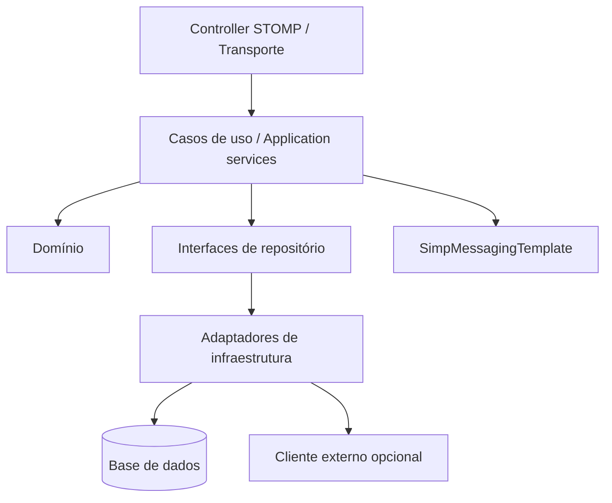
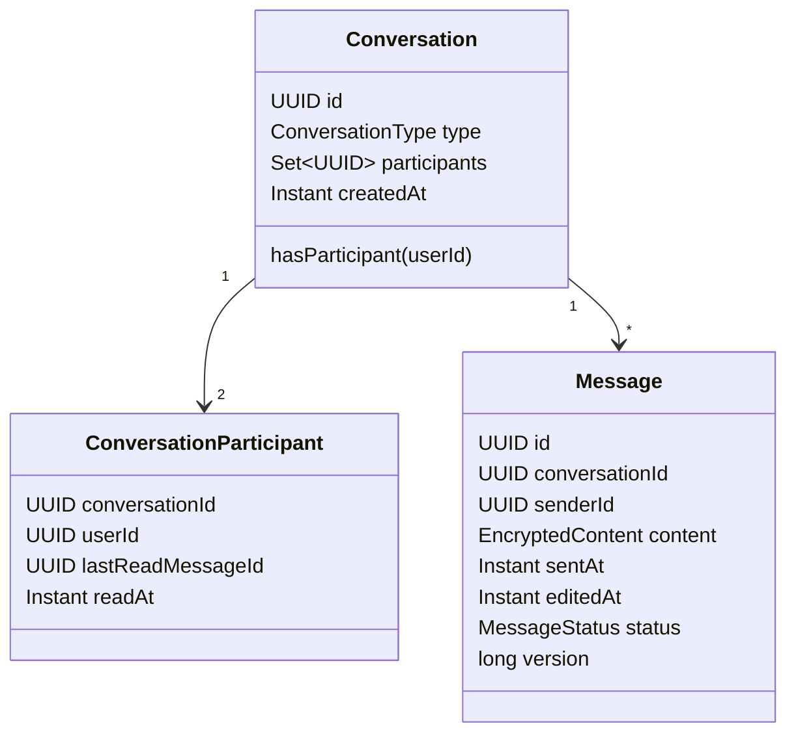
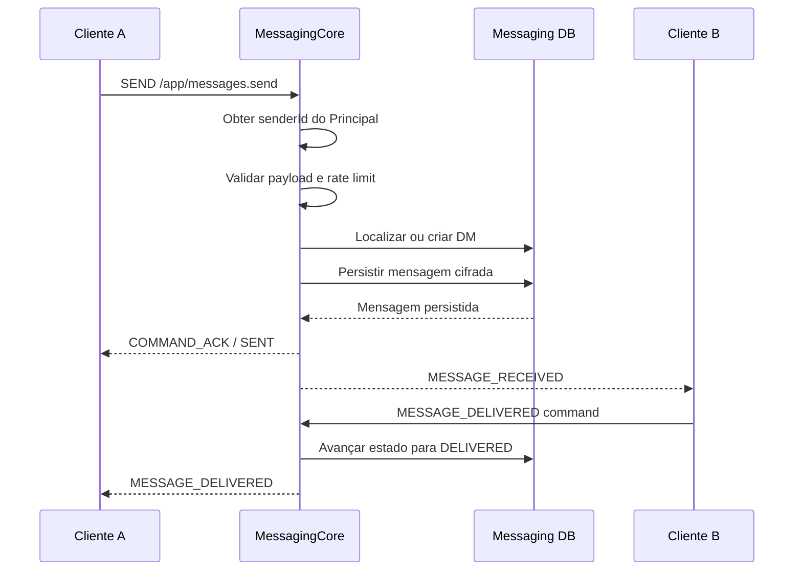
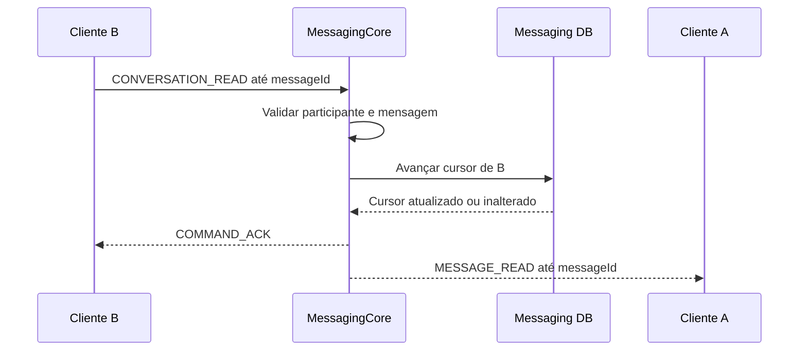
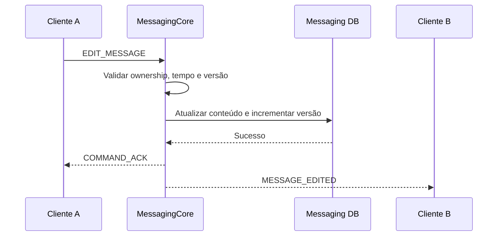
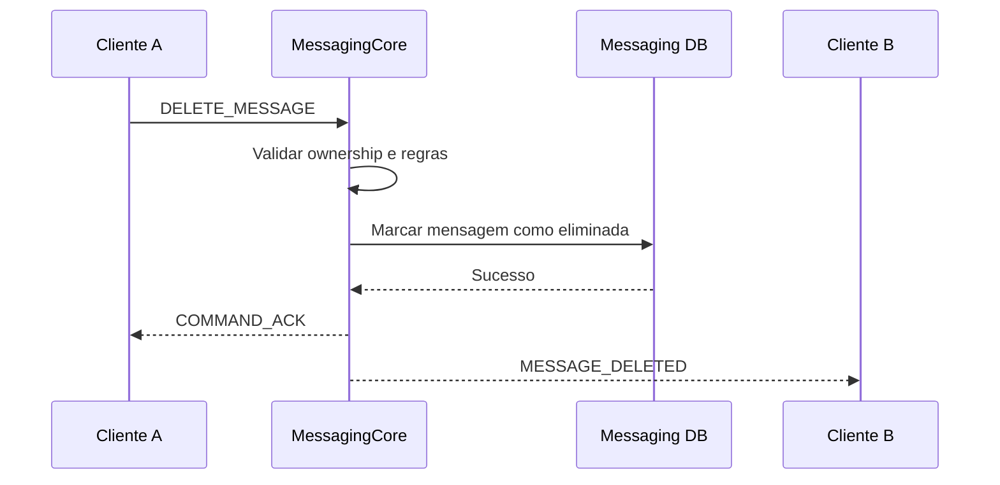
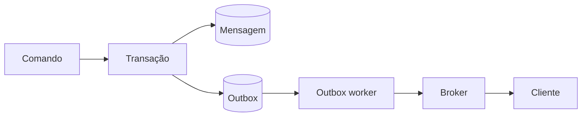
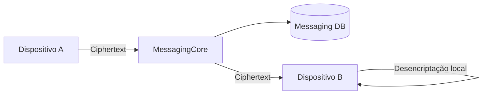

# Arquitetura e design

## 1. Arquitetura pretendida

```mermaid
flowchart LR
    ClientA[Cliente A]
    ClientB[Cliente B]
    Auth[Auth]
    Messaging[MessagingCore]
    AuthDB[(Auth DB)]
    MessagingDB[(Messaging DB)]
    RateLimit[(Rate limiter)]
    Broker[Broker STOMP]
    Outbox[Outbox processor]

    ClientA -->|HTTPS: login| Auth
    Auth --> AuthDB
    Auth -->|JWT com userId| ClientA

    ClientA -->|STOMP/WSS + JWT| Messaging
    ClientB -->|STOMP/WSS + JWT| Messaging

    Messaging --> MessagingDB
    Messaging --> RateLimit
    Messaging --> Broker
    Broker --> ClientA
    Broker --> ClientB

    MessagingDB --> Outbox
    Outbox --> Broker
````

O broker simples incorporado pode ser usado inicialmente. A Outbox e um broker externo são evoluções de fiabilidade, não requisitos para a primeira correção funcional.

---

## 2. Fronteiras dos serviços

### Auth

Responsável por:

- identidade;
- credenciais;
- passwords;
- emissão de JWT;
- roles;
- perfis de utilizador;
- revogação, quando implementada.

Auth não deve conhecer mensagens nem conversas.

### MessagingCore

Responsável por:

- DMs;
- participantes;
- mensagens;
- estados de mensagens;
- cursores de leitura;
- protocolo STOMP;
- notificações relacionadas com mensagens.

MessagingCore guarda IDs de utilizador, não entidades do Auth.

---

## 3. Comunicação Auth → MessagingCore

### Autenticação normal

```mermaid
sequenceDiagram
    participant C as Cliente
    participant A as Auth
    participant M as MessagingCore

    C->>A: Autenticar
    A-->>C: JWT assinado com userId
    C->>M: STOMP CONNECT com JWT
    M->>M: Validar assinatura, issuer, audience e expiração
    M->>M: Criar Principal(userId)
    M-->>C: CONNECTED
```

MessagingCore deve validar o token localmente. Não deve chamar UserService durante cada handshake.

### Informação de perfil

Quando for necessário apresentar username ou avatar, existem três possibilidades:

1. o cliente consulta Auth;
2. MessagingCore usa um cliente HTTP interno limitado;
3. MessagingCore mantém uma projeção local alimentada por eventos.

A primeira solução é suficiente para a recuperação inicial.

---

## 4. Camadas do MessagingCore



### Transporte

Responsável por:

- desserializar;
- validar a forma básica do comando;
- obter Principal;
- aplicar ou chamar rate limiting;
- invocar o caso de uso;
- devolver confirmação estruturada.

Não contém regras de negócio.

### Aplicação

Coordena:

- autorização;
- repositórios;
- domínio;
- transações;
- publicação de eventos.

### Domínio

Contém invariantes como:

- uma DM tem dois participantes distintos;
- apenas o remetente edita;
- estado de leitura não recua;
- estado de entrega não recua.

### Infraestrutura

Implementa:

- persistência;
- cifra em repouso;
- WebSocket;
- integração externa;
- rate limiter;
- outbox.

---

## 5. Modelo de domínio atual



Mesmo que a implementação atual guarde participantes de outra forma, este é o modelo lógico pretendido.

---

## 6. Fluxo de envio



A confirmação SENT significa persistência, não entrega ao destinatário.

---

## 7. Fluxo de leitura



O cursor nunca deve recuar. Repetir o mesmo comando não deve causar erro nem eventos inconsistentes.

---

## 8. Fluxo de edição



---

## 9. Fluxo de eliminação



---

## 10. Destinos privados

Todos os envios privados devem usar:

```text
convertAndSendToUser(userId.toString(), destination, payload)
```

O valor deve coincidir exatamente com:

```text
Principal.getName()
```

É proibido misturar:

- UUID;
- username;
- email.

---

## 11. Gestão de sessões

A gestão deve ficar a cargo do Spring STOMP.

Um mapa manual de WebSocketSession:

- não é necessário para destinos STOMP;
- falha com múltiplas sessões;
- é local a uma instância;
- duplica a responsabilidade do framework.

Se for necessária presença online, deve ser implementada separadamente através de eventos de conexão/desconexão.

---

## 12. Consistência e fiabilidade

### Fase inicial

O evento pode ser processado após a persistência através de eventos transacionais.

### Fase robusta

Usar Outbox:



Mensagem e evento Outbox são gravados na mesma transação. O worker pode repetir o evento, pelo que consumidores e clientes devem tolerar duplicados.

---

## 13. Evolução para grupos

A versão atual deve validar exatamente dois participantes, mas evitar pressupostos espalhados pelo sistema.

Para preparar grupos:

- eventos devem incluir conversationId;
- leitura deve usar cursor por participante;
- destinos privados devem usar userId;
- descoberta do “outro utilizador” deve ficar limitada ao caso de uso DM;
- o domínio deve possuir ConversationType;
- o protocolo não deve chamar a conversa de “otherUser”.

A expansão para grupos exigirá:

- lista variável de participantes;
- permissões;
- eventos de entrada e saída;
- fan-out para vários utilizadores;
- alteração de chaves E2E;
- recibos de entrega/leitura por participante.

---

## 14. Evolução para E2E

Com E2E, MessagingCore deixa de desencriptar mensagens.



Antes de E2E devem estar estáveis:

- identidade por dispositivo;
- sincronização;
- múltiplas sessões;
- mensagens offline;
- versionamento de payload;
- edição e eliminação;
- ordem dos eventos;
- recuperação de estado.
